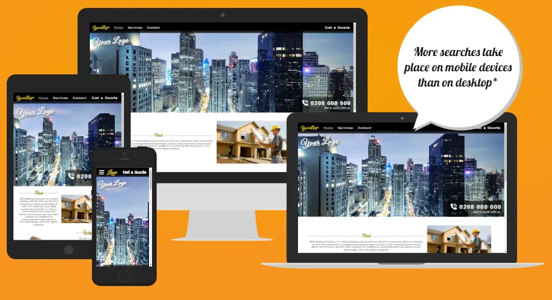

# BCG Building Contractor

BCG Building Contractor is a website project created to help showcase the services of a building firm. The website provides information about the various services that can be provided, such as kitchen installations, door fittings, architraves, fencing, roofing, loft extensions, and new builds. It aims to help potential clients find and contact the contractor online.

**The deployed website can be found here:** [BCG Building Contractors](https://andyv773.github.io/bcg-test)

## Deployment

The site has been deployed to GitHub pages on GitHub.

- The steps to deploy are as follows:
  - In the [GitHub Repository](https://github.com/AndyV773/bcg-test), navigate to the Settings tab
  - In settings select pages in the left hand menu, select source deploy from branch
  - Branch should be main and select from root, then click "Save"
  - Once this has been selected and saved, the site should refresh. At the top of GitHub pages section, there will be a link to the site indicating the successful deployment.

**The deployed website can be found here:** [BCG Building Contractors](https://andyv773.github.io/bcg-test)   

## Credits 

### Content

- The code for the CSS dropdown navbar was taken from the [CI Love Running Project](https://code-institute-org.github.io/love-running-2.0/index.html).
- The icons used in the website come from [Font Awesome](https://fontawesome.com/).
- [W3S Web 3 School](https://www.w3schools.com/) has been used throughout the project as a reference to help remind me about various elements such as iframes and textarea. It was also used for gradient colors and text shadows.

### Media 

- The Favicon icon was generated using [Ionos](https://www.ionos.co.uk/tools/favicon-generator).
- The images have been optimised for the web and converted to .webp using [Free Convert](https://www.freeconvert.com/webp-converter).
- The images where taken from Google.

## Usage

To use the website, simply open it in a web browser. It is designed to be straightforward and user-friendly, providing visitors with information about the contractor's services and contact details.

---

Feel free to get in touch if you have any questions or need further information.
